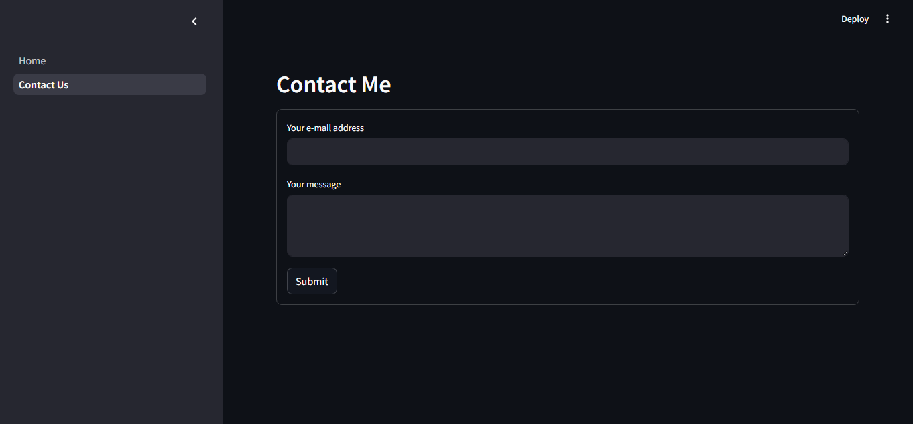

📊 Showcase Website com Streamlit  
Este é um projeto de website interativo construído com Python, utilizando as bibliotecas Streamlit para interface web, Pandas para manipulação de dados e smtplib para envio de e-mails diretamente da aplicação.  
  
  
🚀 Funcionalidades  
Visualização interativa de dados.  
Upload e tratamento de arquivos CSV.  
Envio de e-mails diretamente pela interface.  
Interface simples e responsiva usando Streamlit.  
  
🛠️ Tecnologias utilizadas  
Python  
Streamlit  
Pandas  
smtplib (módulo padrão do Python)  

  
